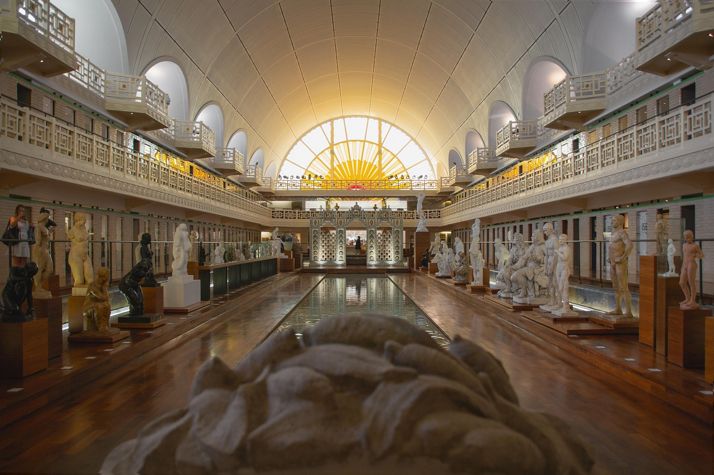
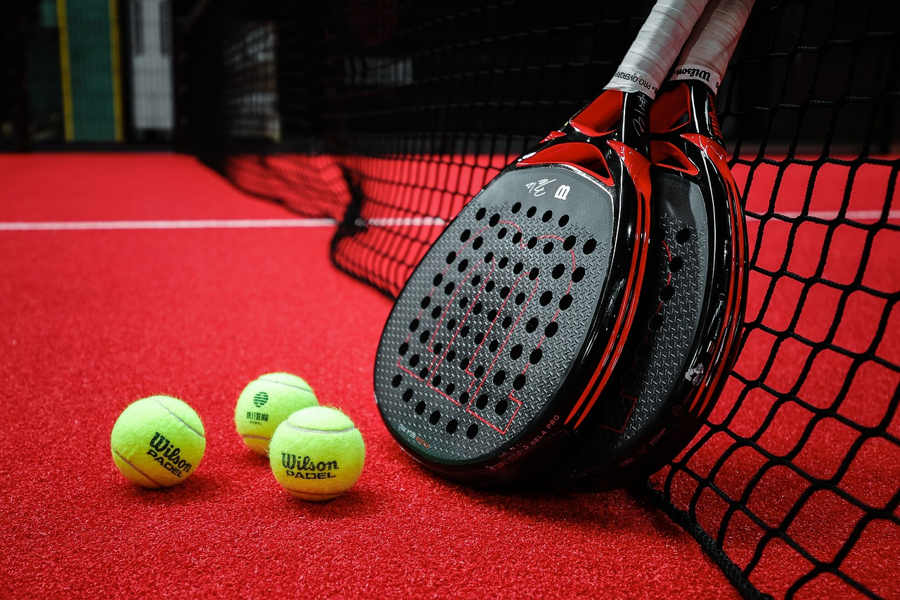
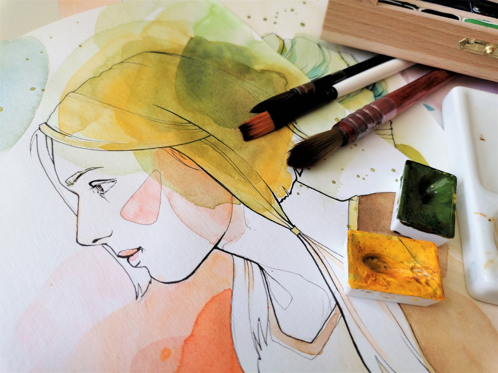
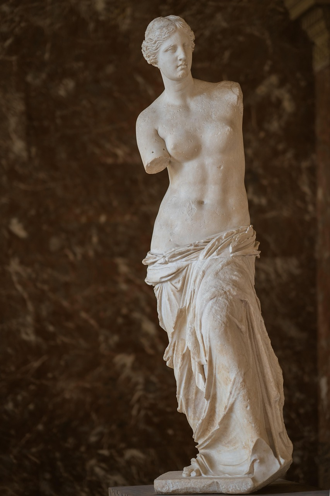

<table class="table">
            <tbody>
                <tr>
                    <th>Inicio</th>
                    <th>Término</th>
                    <th>Comuna</th>
                    <th>Sector</th>
                    <th>Tema</th>
                    <th>Foto</th>
                </tr>
                <tr>
                    <td>2025-03-30  12:00</td>
                    <td>2025-03-30  14:00</td>
                    <td>Providencia</td>
                    <td>Barrio Italia</td>
                    <td>Classe de pintura</td>
                    <td></td>
                    
                </tr>
                <tr>
                    <td>2025-03-31  18:00</td>
                    <td>2025-03-31  19:00</td>
                    <td>Santiago Centro</td>
                    <td>Barrio Bellas Artes</td>
                    <td>Museo de la prehistoria</td>
                    <td></td>
                </tr>
                <tr>
                    <td>2025-03-31  20:00</td>
                    <td>2025-03-31  21:30</td>
                    <td>Ñuñoa</td>
                    <td>Villa Frei</td>
                    <td>Concierto de jazz</td>
                    <td></td>                    
                </tr>
                <tr>
                    <td>2025-04-01  9:30</td>
                    <td>2025-04-01  11:00</td>
                    <td>Providencia</td>
                    <td>Manuel Montt</td>
                    <td>Clase de pádel</td>
                    <td></td>                    
                </tr>
                <tr>
                    <td>2025-04-01  17:00</td>
                    <td>2025-04-01  18:30</td>
                    <td>Las Condes</td>
                    <td>El Golf</td>
                    <td> Introduccion a la gestion</td>
                    <td></td>                    
                </tr>
            </tbody>
        </table>

------------------------------------------

                    <label> Contact </label>
                    

                        

                            <input type="checkbox" name="whatsapp" onchange="updateLabel(this)"> Whatsapp
                            <input type="text" id="whatsapp" style="display: none;" placeholder="ID" class="select-input" minlength="4" maxlength="50">
                        

                        

                            <input type="checkbox" name="telegram" onchange="updateLabel(this)"> Telegram
                            <input type="text" id="telegram" style="display: none;" placeholder="ID" class="select-input" minlength="4" maxlength="50">
                        

                        

                            <input type="checkbox" name="x" onchange="updateLabel(this)"> X
                            <input type="text" id="x" style="display: none;" placeholder="ID" class="select-input" minlength="4" maxlength="50">
                        

                        

                            <input type="checkbox" name="instagram" onchange="updateLabel(this)"> Instagram
                            <input type="text" id="instagram" style="display: none;" placeholder="ID" class="select-input" minlength="4" maxlength="50">
                        

                        

                            <input type="checkbox" name="tiktok" onchange="updateLabel(this)"> TikTok
                            <input type="text" id="tiktok" style="display: none;" placeholder="ID" class="select-input" minlength="4" maxlength="50">
                        

                        

                            <input type="checkbox" name="otra" onchange="updateLabel(this)"> Otra
                            <input type="text" id="otra" style="display: none;" placeholder="ID" class="select-input" minlength="4" maxlength="50">
                        

                    

                

---------------------------------------------------
listes activités

<a href="información.html">
            <table class="table">
                <tbody>
                    <tr>
                        <th>Inicio</th>
                        <th>Término</th>
                        <th>Comuna</th>
                        <th>Sector</th>
                        <th>Tema</th>
                        <th> Nombre Organizador</th>
                        <th>Total Fotos</th>
                    </tr>
                    <tr>
                        <td>2025-03-30  12:00</td>
                        <td>2025-03-30  14:00</td>
                        <td>Providencia</td>
                        <td>Barrio Italia</td>
                        <td>Classe de pintura</td>
                        <td>Juan Valdés Fuentes</td>
                        <td></td>
                    </tr>
                    <tr>
                        <td>2025-03-31  18:00</td>
                        <td>2025-03-31  19:00</td>
                        <td>Santiago Centro</td>
                        <td>Barrio Bellas Artes</td>
                        <td>Museo de la Antigüedad</td>
                        <td>María Rojas Torres</td>
                        <td></td>
                    </tr>
                    <tr>
                        <td>2025-03-31  20:00</td>
                        <td>2025-03-31  21:30</td>
                        <td>Ñuñoa</td>
                        <td>Villa Frei</td>
                        <td>Concierto de jazz</td>
                        <td>Francisco Castillo Araya</td>
                        <td></td>                    
                    </tr>
                    <tr>
                        <td>2025-04-01  9:30</td>
                        <td>2025-04-01  11:00</td>
                        <td>Providencia</td>
                        <td>Manuel Montt</td>
                        <td>Clase de pádel</td>
                        <td>Carlos Sánchez Muñoz</td>
                        <td></td>                    
                    </tr>
                    <tr>
                        <td>2025-04-01  17:00</td>
                        <td>2025-04-01  18:30</td>
                        <td>Las Condes</td>
                        <td>El Golf</td>
                        <td> Introduccion a la gestion</td>
                        <td>Camila  Gómez Pérez</td>
                        <td></td>                    
                    </tr>
                </tbody>
            </table>
        </a>

----------------------------------------
information 

        <h1> Museo de la Antigüedad </h1>

        

            <b>Partie I : ¿Dónde?</b>  
            

                <b>Región :</b> Región Metropolitana de Santiago 
                <b>Comuna :</b> Santiago Centro 
                <b>Sector :</b> Barrio Bellas Artes 
            

            
            <b>Partie II : ¿Quién organiza?</b>
            

                <b>Nombre :</b> María Rojas Torres 
                <b>Email :</b> maría.rojas@gmail.com 
                <b>Número de celular :</b> +569.15240890 
                <b>Contactar por :</b> Instagram (@maría_rojas) 
            

            <b>Partie III : ¿Cuándo y de qué trata?</b>
            

                <b>Día hora inicio :</b> 2025-03-31 / 18:00   
                <b>Día hora término :</b> 2025-03-31 / 19:00 
                <b>Descripción :</b> Si quiere desarrollar su cultura histórica, ha llegado al lugar adecuado. Acompáñanos en una visita al Museo de la Antigüedad y aprende todo sobre el tema. Saldrás sabiéndolo todo sobre las deidades griegas y romanas, los imperios romanos y sus conquistas, la batalla de Troya y mucho más. ¡Le esperamos el 31/03/2025! 
                <b>Tema :</b> Museo de la Antigüedad  
            

            <b>Partie IV : Fotos</b>  
            <button class="boton" onclick="ampliar(1)">
                
            </button>

            <button class="boton" onclick="ampliar(2)">
                
            </button>
                
            

                

                    <button class="close-btn" onclick="fermer(1)">X</button>
                    
                

            

            

                

                    <button class="close-btn" onclick="fermer(2)">X</button>
                    
                

            

        

        

            <a href="Listados_actividades.html" class="contact">
                
 Listado de actividades  

            </a>

            <a href="index.html" class="contact">
                
 Pagina principal 

            </a>
        

    

    -----------------------------------------
    comunas 

    function modificarComunas() {
    let regionSelect = document.getElementById("región");
    let comunaSelect = document.getElementById("comuna");

    comunaSelect.innerHTML = '<option value="none">Seleccione una comuna</option>';

    let selectedRegion = regionSelect.value;
    if (selectedRegion!=="none" && comunasPorRegion[selectedRegion]) {
        comunasPorRegion[selectedRegion].forEach(comuna => {
            let option = document.createElement("option");
            option.value = comuna.toLowerCase().replace(/ /g, "_");
            option.textContent = comuna;
            comunaSelect.appendChild(option);
        });
    }
};

-------------------------------
confirmation

        

            
<b>¿Está seguro que desea agregar esta actividad?</b>

            <button id="btnSi">Sí</button>
            <button id="btnNo">No</button>
        

    

    

        

            
<b>Hemos recibido su información, muchas gracias y suerte en su actividad !</b>

            <a href="index.html" class="contact">
                
 Pagina principal 

            </a>                
        

    
